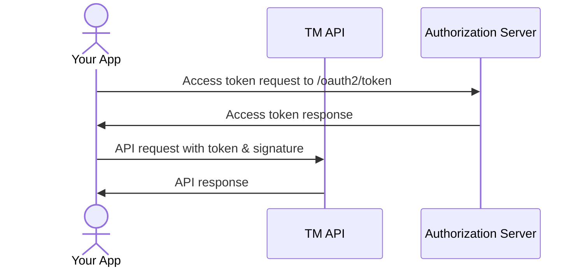
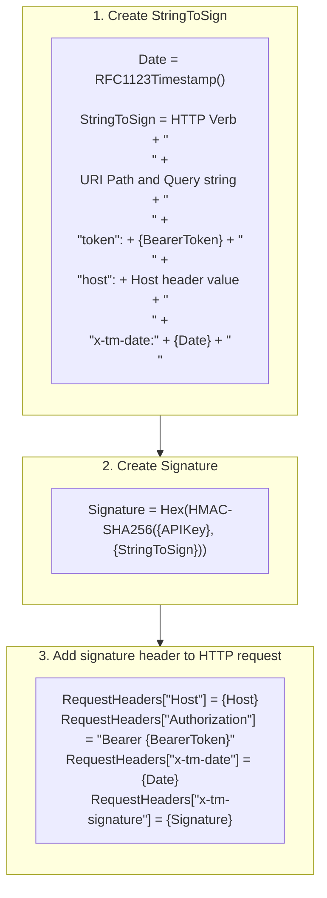

# Tournament Manager Public API Guide
**Version 1.2**

> *[Image Description: The document cover displays the Tournament Manager logo—a stylized gray rounded-square bracket icon featuring white bracket lines with a small red square badge in the upper right containing a white VEX 'V' logo—centered above the title "Tournament Manager Public API Guide" and "Version 1.2".]*

---

## Table of Contents

* **Table of Contents** — 2
* **Introduction** — 4
* **Usage Restrictions** — 4
* **API Access** — 5
  * Credentials Request — 5
  * Authentication — 5
    * OAuth Token — 5
    * Request Signing — 6
  * Rate Limits and Client Behavior — 7
    * Last-Modified/If-Modified-Since headers — 8
  * Enabling the API in TM — 8
* **API Resources** — 10
  * Event Resource — 10
  * Division List Resource — 11
  * Team List Resource — 12
  * Match List Resource — 13
  * Rankings Resource — 15
  * Skills Resource — 16
  * Field Set List Resource — 17
  * Field List Resource — 18
  * Field Set Websocket — 19
    * Events — 19
      * Match Assigned to Field — 19
      * Field Activated — 19
      * Match Started — 19
      * Match Stopped — 20
      * Audience Display Changed — 20
    * Commands — 20
      * Start Match — 20
      * End Match Early — 20
      * Abort Match — 20
      * Reset Timer — 20
      * Queue Previous Match — 20
      * Queue Next Match — 21
      * Queue Skills — 21
      * Set Audience Display — 21

---

## Introduction

The Tournament Manager Public API (TM API) has been introduced to allow 3rd party developers to build tools and integrations that interoperate with Tournament Manager.

The TM API is intended to enable certain types of permitted integrations with TM. Examples of encouraged integrations include:
* Automatically recording and/or uploading individual competition matches
* Controlling a video switcher to select a camera associated with the active field
* Adding macropad support
* Controlling a PTZ camera to point to the active field
* Automatically switching the audience display screen selection based on various conditions

We are excited to see what kinds of other tools and uses the community comes up with. Offering an official API is going to be a learning experience for all involved as we find out what kinds of ideas are out there. With that said, some types of interactions will be off-limits, even if they may be technically possible with the TM API. These limitations may change in the future (either more or less restrictive) as we learn more about what developers intend to do with the API.

---

## Usage Restrictions

Event partners and users of the TM API should not attempt to replace TM functionality. Examples of uses that are not allowed include, but are not limited to:
* Alternative or augmented audience, pit, field, or other displays
* Mobile or web applications with similar functionality to TM or TM Mobile
* Match timer displays or devices

These limitations exist to ensure a consistent team experience, accessibility, competition integrity, proper branding, and sponsor recognition at all events.

By using the TM API, you:

1. Agree to follow all terms of the VEX Tournament Manager Software License Agreement.
2. Agree not to obscure, hide, replace, or interfere with any of the branding, logos, and sponsorships, or other information displayed to the public by Tournament Manager. Events should always use the regular TM features & displays.
3. Agree not to create software or systems designed to replace Tournament Manager functionality, such as alternative audience or pit displays, match time displays or devices, TM Mobile, VEX via, etc.
4. Agree not to access any private or internal APIs or other interfaces that are part of TM or related software or servers.
5. Agree that the TM API is for non-commercial use only. You may not sell software, services, etc. that make use of the TM API.
6. Agree that the TM API is provided “as-is” without warranty of any kind. While we hope to maintain compatibility in the future, we reserve the right to modify or discontinue the API at any time.

---

## API Access

### Credentials Request

To submit your request for credentials to access the TM API, please fill out this form:

[TM API Credentials Request Form](#)

---

### Authentication

There are 2 parts to authentication and authorization with the TM API: the first, an OAuth token, authenticates that your app is an app that is approved for API access while the second part, an HTTP request signature based on an API key, is used to validate that the Event Partner has permitted your app to access their instance of Tournament Manager.

After applying and being approved for API access, you will be provided with a Client ID and Client Secret that you can use to obtain OAuth tokens. It is your responsibility to take steps to keep the client secret you are issued secure. If your secret is leaked, shared with others, or used for functionality outside of what was described in your API access application, it may be revoked. For example, if you intend to publish the source code to your project, make sure not to include the client ID and secret.

#### OAuth Token

The TM API uses an OAuth 2.0 Client Credentials flow for authorization. This means that you will take your client ID and client secret and use them to call an OAuth server which will validate those credentials and return to you a bearer token. You can then use the bearer token to access the TM API. The bearer token has a short lifetime so your app will need to retrieve a new token periodically.

To obtain the token, POST your `client_id`, `client_secret`, and `grant_type` to `https://auth.vextm.dwabtech.com/oauth2/token` as a form-encoded body. You can also supply `client_id` and `client_secret` using HTTP basic access authentication in the `Authorization` header. The `grant_type` parameter should be set to `client_credentials`. Your preferred programming language likely has an OAuth client library already available.

If your client ID and secret are valid, the OAuth server will return a JSON response with `access_token`, `token_type`, and `expires_in` fields. The `expires_in` field indicates how long (in seconds) the token is valid for. The `access_token` and `token_type` fields should be used to construct an `Authorization` header for calling the TM API.

Your app should cache the token and reuse it for future API requests until it expires. Do not call the authorization server for a new token each time you want to make an API request.



Further details can be found at <https://oauth.net/2/grant-types/client-credentials/> if needed.

---

### Request Signing

When the Event Partner enables the TM API in Tournament Manager, an API key value is created. Your app will need a way to accept this value from the user, and then your app will need to use this value to sign requests to the TM API. This helps to ensure that your app has been authorized by the Event Partner to access the event.

Each request to the TM API must be signed. Request signing is based on the HTTP request headers. A signature is created by taking the TM API key along with the value of several of the HTTP request headers and then creating a hash-based message authentication code (HMAC) using the SHA256 hash function.

The inclusion of the `x-tm-date` header helps ensure that previous message signatures cannot be reused at a later point in time, and therefore requires that the client making the request has a clock which is synchronized with the TM API server.



---

### Rate Limits and Client Behavior

Make sure the app you develop is a responsible API client. This includes not making an excessive number of requests to the TM API in a short period of time, properly caching response values, and usage of the `If-Modified-Since` header (see below). As a general guideline, there should be no need to query any of the API resources defined in this document more than about once per minute - event changes typically do not happen any faster than the match cycle time.

At the time of writing this document, the TM API does not enforce any rate limits. However, limits may be added at a later time, especially if it becomes apparent that apps are generating unnecessary load.

#### Last-Modified/If-Modified-Since headers

Most of the API resources defined in this document will provide a `Last-Modified` response header value. Future requests to the same API resource should provide the previously-returned `Last-Modified` value in the `If-Modified-Since` header. When this header is provided, TM will return a `304 Not Modified` response if the resource has not changed since the previous query. This helps reduce resource utilization on TM and also helps you avoid redundant processing in your app.

Further information about these headers can be found on MDN:
<https://developer.mozilla.org/en-US/docs/Web/HTTP/Headers/If-Modified-Since>

---

### Enabling the API in TM

In order to use your app, the Event Partner will need to enable the local TM API in the Tournament Manager settings. Open Tournament Manager and select the **Tools** menu, then **Options**. When the Options window opens, select the **Web Publishing** category. Check the **Enable Local TM API** checkbox and save the changes. The Event Partner will need to check this box for each event that they host.

> *[Image Description: A screenshot of the Tournament Manager 'Options' window with the 'Web Publishing' category selected on the left sidebar. The right side shows: (1) 'Web Publishing Setup' containing settings for events.vex.com and manual 'Publish Now:' buttons; (2) 'Local API' section with a disclaimer regarding 3rd party tools, an enabled checkbox for '[x] Enable Local TM API', an 'API Key' field displaying `scVJ3pD5Wm4fDKsRD8vBnBNZxcvybNcu`, and a [Copy] button, along with [Cancel] and [Save Changes] buttons at the bottom right.]*

---

## API Resources

All API resources are hosted by the TM Web Server. URLs listed below are relative to the web server's base address, typically `http://{server IP}` or `http://{server IP}:8080`. You will likely want to allow your app’s users to configure the TM web server address somewhere within your app.

---

### Event Resource

| Method | GET |
| :--- | :--- |
| **URL** | `/api/event` |
| **Response format** | JSON |

#### Example response
```json
{
  "event": {
    "name": "Hudsonville HS Over Under Tournament",
    "code": "RE-VRC-23-2523"
  }
}
```

The Event resource returns a JSON object containing basic information about the event. The `code` field is the VEX Events SKU (if configured for the event).

---

### Division List Resource

| Method | GET |
| :--- | :--- |
| **URL** | `/api/divisions` |
| **Response format** | JSON |

#### Example response
```json
{
  "divisions": [
    {
      "name": "Science",
      "id": 1
    },
    {
      "name": "Technology",
      "id": 2
    },
    {
      "name": "Engineering",
      "id": 3
    },
    {
      "name": "Math",
      "id": 4
    }
  ]
}
```

The Division List resource returns a JSON object containing a list of division names and IDs.

---

### Team List Resource

| Method | GET |
| :--- | :--- |
| **URL** | `/api/teams`<br>or<br>`/api/teams/{division_id}` |
| **Response format** | JSON |

#### Example response
```json
{
  "teams": [
    {
      "number": "10D",
      "name": "Exothermic Dusk",
      "shortName": "",
      "school": "Exothermic Robotics",
      "sponsors": "",
      "city": "Redmond",
      "state": "Washington",
      "country": "United States",
      "ageGroup": "HIGH_SCHOOL",
      "divId": 1,
      "checkedIn": false
    },
    ...
  ]
}
```

The Team List resource returns a JSON object containing a list of teams for the whole event or for just a single division if the division ID is provided.

> **NOTE:** The `sponsors` and `shortName` fields are not generally used and may be removed in a future update. The `school` field may be renamed to `organization` at some point. Finally, the `city`, `state`, and `country` fields will likely be combined into a `location` field in the near future.

---

### Match List Resource

| Method | GET |
| :--- | :--- |
| **URL** | `/api/matches/{division_id}` |
| **Response format** | JSON |

#### Example response
```json
{
  "matches": [
    {
      "finalScore": [
        17,
        11
      ],
      "matchInfo": {
        "timeScheduled": 1688306400,
        "state": "SCORED",
        "alliances": [
          {
            "teams": [
              {
                "number": "16"
              },
              {
                "number": "4"
              }
            ]
          },
          {
            "teams": [
              {
                "number": "14"
              },
              {
                "number": "15"
              }
            ]
          }
        ],
        "matchTuple": {
          "session": 0,
          "division": 1,
          "round": "QUAL",
          "instance": 1,
          "match": 1
        }
      },
      "winningAlliance": 0
    },
    ...
  ]
}
```

The Match List resource returns a JSON object containing a list of matches for the specified division. Each match object includes information on the alliances and teams included as well as whether the match is scored and if so, the final score values and winning alliance number.

---

### Rankings Resource

| Method | GET |
| :--- | :--- |
| **URL** | `/api/rankings/{division_id}/{match_round}` |
| **Response format** | JSON |

#### Example response
```json
{
  "rankings": [
    {
      "rank": 1,
      "tied": false,
      "alliance": {
        "name": "",
        "teams": [
          {
            "number": "7925S"
          }
        ]
      },
      "wins": 10,
      "losses": 0,
      "ties": 0,
      "wp": 26,
      "ap": 80,
      "sp": 1027,
      "avgPoints": 198.39999389648438,
      "totalPoints": 1984,
      "highScore": 236,
      "numMatches": 10,
      "minNumMatches": true
    },
    ...
  ]
}
```

The Rankings resource returns a JSON object containing a list of rankings for the specified division and match round. Not all rankings parameters that are returned are relevant for every game or program type.

---

### Skills Resource

| Method | GET |
| :--- | :--- |
| **URL** | `/api/skills` |
| **Response format** | JSON |

#### Example response
```json
{
  "skillsRankings": [
    {
      "rank": 1,
      "tie": false,
      "number": "1082C",
      "totalScore": 10,
      "progHighScore": 10,
      "progAttempts": 1,
      "driverHighScore": 0,
      "driverAttempts": 0
    },
    ...
  ]
}
```

The Skills resource returns a JSON object containing a list of teams who have played in the skills competitions and includes their current rank and high score information. If the `tie` value is `true`, it indicates that the team's rank is shared with at least one other team.

---

### Field Set List Resource

| Method | GET |
| :--- | :--- |
| **URL** | `/api/fieldsets` |
| **Response format** | JSON |

#### Example response
```json
{
  "fieldSets": [
    {
      "id": 1,
      "name": "Match Field Set #1"
    },
    {
      "id": 2,
      "name": "Match Field Set #2"
    },
    {
      "id": 3,
      "name": "Match Field Set #3"
    }
  ]
}
```

The Field Set List endpoint returns a JSON object containing a list of configured field sets including the name and field set ID.

---

### Field List Resource

| Method | GET |
| :--- | :--- |
| **URL** | `/api/fieldsets/{field_set_id}/fields` |
| **Response format** | JSON |

#### Example response
```json
{
  "fields": [
    {
      "id": 3,
      "name": "Yellow Field"
    },
    {
      "id": 4,
      "name": "Green Field"
    },
    {
      "id": 5,
      "name": "Purple Field"
    }
  ]
}
```

The Field List endpoint returns a JSON object containing a list of fields configured within the specified field set, including the name and field ID.

---

### Field Set Websocket

| URL | `/api/fieldsets/{field_set_id}` |
| :--- | :--- |
| **Protocol** | `ws://` |
| **Message format** | JSON |

The Field Set Websocket lets your application receive field set events and issue field set commands.

---

#### Events

Events are messages that the TM API may send to your client when certain conditions occur.

##### Match Assigned to Field
```json
{
  "type": "fieldMatchAssigned",
  "fieldID": 1,
  "match": {
    "division": 1,
    "session": 0,
    "round": "QUAL",
    "match": 2,
    "instance": 1
  }
}
```

##### Field Activated
```json
{
  "type": "fieldActivated",
  "fieldID": 1
}
```

##### Match Started
```json
{
  "type": "matchStarted",
  "fieldID": 1
}
```

##### Match Stopped
```json
{
  "type": "matchStopped",
  "fieldID": 1
}
```

##### Audience Display Changed
```json
{
  "type": "audienceDisplayChanged",
  "display": "IN_MATCH"
}
```

---

#### Commands

Commands are messages that your app may send to TM to cause certain actions to happen.

##### Start Match
```json
{
  "cmd": "start"
}
```

##### End Match Early
```json
{
  "cmd": "endEarly"
}
```

##### Abort Match
```json
{
  "cmd": "abort"
}
```

##### Reset Timer
```json
{
  "cmd": "reset"
}
```

##### Queue Previous Match
```json
{
  "cmd": "queuePrevMatch"
}
```

##### Queue Next Match
```json
{
  "cmd": "queueNextMatch"
}
```

##### Queue Skills
```json
{
  "cmd": "queueSkills",
  "skillsID": 1
}
```

##### Set Audience Display
```json
{
  "cmd": "setAudienceDisplay",
  "display": "RANKINGS"
}
```